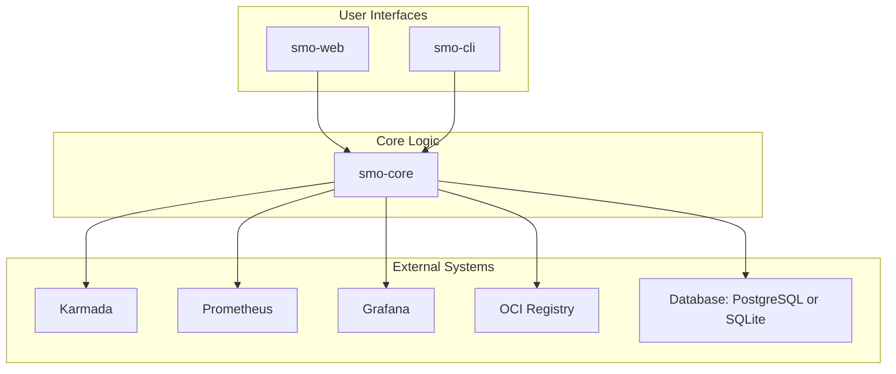

# Synergetic Meta-Orchestrator (SMO) - H3NI Refactoring

The Synergetic Meta-Orchestrator (SMO) is an advanced, intent-driven control plane for deploying, managing, and optimizing complex, multi-component applications across distributed Kubernetes environments.

This repository contains the full source code for the SMO project, **refactored into a modular monorepo structure, with additional CLI capacities.**


## Core Features

*   **Intent-Based Deployment**: Deploy complex applications, known as Hyper Distributed Application Graphs (HDAGs), from a single declarative YAML descriptor.
*   **Optimized Placement & Scaling**: Utilizes mathematical optimization (via CVXPY) to determine the ideal cluster placement for each service and to dynamically adjust replica counts based on real-time metrics.
*   **Multi-Cluster Orchestration**: Leverages [Karmada](https://karmada.io/) as a robust execution engine to manage resources across a federation of Kubernetes clusters.
*   **Proactive Observability**: Automatically generates and publishes detailed [Grafana](https://grafana.com/) dashboards and [Prometheus](https://prometheus.io/) alert rules, providing immediate operational visibility for deployed applications.
*   **Modular Architecture**: The project is cleanly separated into a core logic library (`smo-core`) and distinct user interfaces (`smo-cli` and `smo-web`), promoting reusability and clean design.


## Project Architecture

This monorepo is structured into three distinct Python packages, creating a clean, layered architecture:

1.  **`smo-core`**: The foundational library and engine of the SMO. It contains all the business logic, database models, helper utilities, and orchestration algorithms. It is completely headless and framework-agnostic.

2.  **`smo-cli`**: A powerful command-line interface for interacting with the SMO engine. It provides a direct, scriptable way to manage the entire lifecycle of HDAGs. It depends on `smo-core`.

3.  **`smo-web`**: A modern, API-first web service built with [Connexion](https://connexion.readthedocs.io/). It exposes the SMO's functionality via a REST API defined in an OpenAPI (YAML) specification, complete with an interactive Swagger UI. It also depends on `smo-core`.

4. **`smo-sdk`**: A Python SDK, auto-generated from the smo-web OpenAPI specification. It provides a convenient, type-safe, and pythonic way to interact with the SMO REST API from other applications, tests, or scripts. It supports both synchronous and asynchronous operations. This is still experimental and used mostly as a debugging tool.

=> [Additional technical details and implementation notes can be found in the `NOTES.md` file.](./NOTES.md)

=> [TODO items and future work are tracked in the `TODO.md` file.](./TODO.md)

### Dependency Graph



---

## Development Setup

This guide assumes you have **Python 3.12+** and `uv` installed.

### 1. Clone the Repository

```bash
git clone https://gitlab.eclipse.org/eclipse-research-labs/nephele-project/opencall-2/h3ni/smo-monorepo.git
cd smo-monorepo
```

### 2. Create a Virtual Environment and Install Packages

```bash
uv sync
```

## Using the Packages

### `smo-cli`

The command-line interface is the most direct way to interact with the SMO engine. It stores its state in a local SQLite database located in `~/.smo/`.

#### First-Time Setup

Before first use, you must initialize the CLI. This creates the configuration file and database.

```bash
smo-cli init
```
After running this, **you must edit the configuration file** at `~/.smo/config.yaml` to point to your Karmada kubeconfig, Prometheus, and Grafana instances.

#### Basic Usage

```bash
# Sync cluster information from Karmada into the local DB
smo-cli cluster sync

# List all known clusters
smo-cli cluster list

# Deploy a graph from a YAML file into a project
smo-cli graph deploy --project my-project /path/to/my-hdag.yaml

# List all deployed graphs
smo-cli graph list

# Get detailed information about a specific graph
smo-cli graph describe my-test-graph

# Trigger a re-placement optimization for a running graph
smo-cli graph re-place my-test-graph

# Completely remove a graph
smo-cli graph remove my-test-graph
```

For more commands, use `smo-cli --help` or `smo-cli <command> --help`.

### `smo-web`

The web application provides a REST API for the SMO engine. It is designed to run as a containerized service and connect to a PostgreSQL database.

#### Configuration

The web app uses environment variables for configuration, typically loaded from a `.env` file. You can create a `config/flask.env` file within the `smo-web` directory to configure the database connection, Karmada path, etc.

#### Running Locally for Development

The recommended way to run the web app for development is with `uvicorn`, which provides live reloading.

```bash
# Navigate to the web package directory
cd smo-web

# Run the uvicorn server
uvicorn smo_web.app:app --reload
```

The API will be available at `http://localhost:8000`. The interactive Swagger UI documentation can be accessed at `http://localhost:8000/ui/`.

#### Running in Production

For production, use a process manager like Gunicorn with the Uvicorn worker class. A `Dockerfile` is provided to build a production-ready container image.

```bash
# Build the Docker image
docker build -t smo-web:latest -f smo-web/Dockerfile .

# Run the container (example)
docker run -p 8000:8000 -v ~/.kube:/root/.kube smo-web:latest
```
*(Note: You will need a running PostgreSQL instance and will need to configure the container's environment variables to connect to it.)*


## Testing

Each package contains its own dedicated test suite.

```bash
uv run make test
uv run make lint
# Or
uv run nox
```

## Prerequisites & Environment

To fully utilize the SMO, your environment should have the following systems running and accessible:

*   **Kubernetes & Karmada**: A running Karmada control plane with at least one member Kubernetes cluster joined.
*   **OCI Registry**: A container registry (like Docker Hub, Harbor, or a local instance) accessible from your Kubernetes clusters.
*   **Prometheus**: For monitoring metrics that drive the scaling algorithms.
*   **Grafana**: For visualizing the auto-generated dashboards.
*   **`hdarctl` & `helm`**: These CLI tools must be installed and available in the `PATH` of the environment running the SMO (either locally for the CLI or inside the web app's container).

See the <https://gitlab.eclipse.org/eclipse-research-labs/nephele-project/opencall-2/h3ni/smo-deploy.git> repository for helpers to install and configure a proper testing environment.
