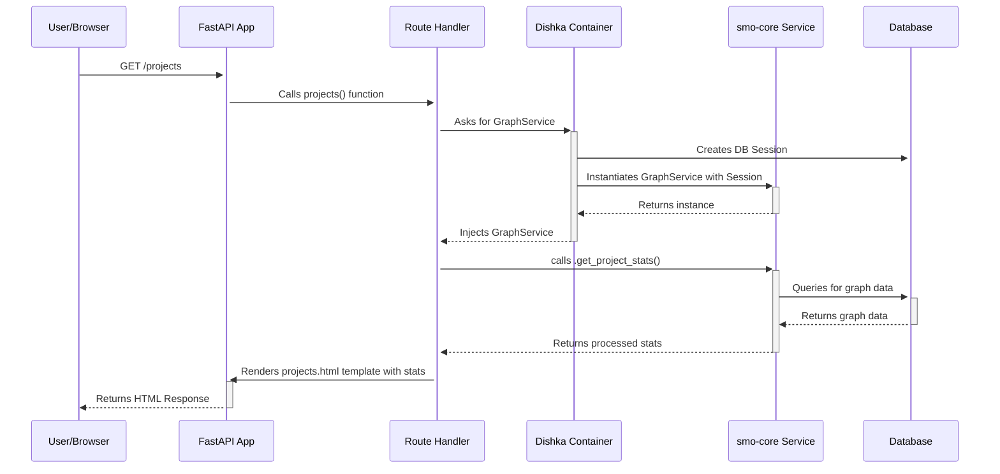

# The Architecture of the SMO Web UI (`smo-ui`)

**Objective:** This document outlines the complete, target architecture for the `smo-ui` web application. It assumes the refactoring to `dishka` for dependency injection is finished and all core functionalities are implemented.

#### 1. Guiding Principles & High-Level Vision

The `smo-ui` is designed to be a **thin, user-friendly, server-side rendered web interface** for the `smo-core` engine. Its primary architectural principles are:

*   **Strict Decoupling:** The UI contains **no core business logic**. Its sole responsibility is to handle user interactions (HTTP requests), delegate all complex operations to the `smo-core` library, and render the results in a clear HTML format.
*   **Simplicity and Maintainability:** The technology stack is deliberately kept simple (FastAPI + Jinja2) to ensure the application is easy to understand, maintain, and extend. We avoid heavy frontend frameworks in favor of server-rendered HTML.
*   **Robustness and Testability:** The entire application is built around a Dependency Injection (DI) pattern, which makes its components isolated, modular, and highly testable.

#### 2. Architectural Layers

The application is structured into several distinct layers, each with a clear responsibility.

A typical request flows through these layers as follows:

**a. Presentation Layer (HTML Templates & Static Assets)**

*   **Technology:** Jinja2 templates.
*   **Location:** `smo-ui/src/smo_ui/templates/`
*   **Description:** This layer is responsible for the final HTML output. It uses a standard `base.html` template that all other pages extend, ensuring a consistent layout, header, and sidebar. The logic within the templates is minimal, focused only on displaying the data passed in from the Application Layer (e.g., looping through a list of clusters).
*   **Frontend Components:** For reusable UI elements like the navigation sidebar, we use a simple, lightweight **Web Component** (`smo-ui/src/smo_ui/static/js/components.js`). This avoids the need for a complex JavaScript framework while keeping the UI consistent and maintainable. All styling is handled by a single CSS file (`common.css`).

**b. Application Layer (FastAPI & Routing)**

*   **Technology:** FastAPI.
*   **Location:** `smo-ui/src/smo_ui/routes/`
*   **Description:** This layer handles all incoming HTTP requests. The routing is modular, with each feature (e.g., graphs, clusters) having its own file in the `routes` directory. The main `app.py` simply includes these routers.
*   **Handler Responsibility:** The role of a route handler function is extremely narrow and well-defined:
    1.  Receive the web request.
    2.  Declare the `smo-core` service it needs via `dishka` injection.
    3.  Call the appropriate method on the injected service.
    4.  Pass the data returned from the service into a Jinja2 template.
    5.  Return the rendered HTML response.

**c. Service Layer (Delegation to `smo-core`)**

*   **Technology:** `smo-core` Python library.
*   **Description:** **The `smo-ui` application contains no business logic.** It acts purely as a *client* to the `smo-core` library. All actions—fetching clusters, deploying graphs, calculating placement—are handled by calling the relevant service class (e.g., `GraphService`, `ClusterService`) from `smo-core`. This ensures that logic is centralized, reusable (by `smo-cli`, `smo-web`, etc.), and tested independently.

**d. Data Layer (SQLAlchemy & Alembic)**

*   **Technology:** SQLAlchemy ORM, Alembic for migrations.
*   **Model Location:** `smo-core/src/smo_core/models/`
*   **UI-Specific Model Location:** `smo-ui/src/smo_ui/models/`
*   **Description:** While most data models (`Graph`, `Cluster`, `Service`) are defined in `smo-core`, the `smo-ui` is responsible for managing its own database schema. This includes UI-specific models like `Event`.
*   **Schema Migrations:** We use **Alembic** to manage database schema changes. This allows us to evolve the database structure over time in a safe, version-controlled manner without requiring manual SQL changes. The migration scripts are located in `smo-ui/src/smo_ui/migrations/`.

#### 3. Key Components & Concepts

**a. Dependency Injection (The Heart of the Application)**

*   **Orchestrator:** `dishka` manages the lifecycle of all our key objects.
*   **Configuration:** The "instruction manuals" in `smo-ui/src/smo_ui/providers.py` define how to create every dependency, from the database session to the `smo-core` services.
*   **Request Scoping:** `dishka` is configured to use `Scope.REQUEST`. This means that for every incoming HTTP request, it creates a brand new, isolated set of services and a new database session. When the request is finished, these are automatically destroyed, preventing data leaks and ensuring resources are properly managed.

**b. Configuration**

The application uses a simple, file-based configuration system.
*   A `config.yaml` file provides default settings.
*   The `smo_ui/src/smo_ui/config.py` module loads this file and makes the settings available to the DI container.
*   This setup is straightforward for development and can be easily adapted to use environment variables for production container deployments.

**c. Testing Strategy**

The DI architecture makes testing elegant and effective.
*   **Integration Tests (`tests/test_routes.py`):** We use FastAPI's `TestClient` to make mock HTTP requests to our application.
*   **Dependency Overriding:** The most powerful feature for testing is the ability to override DI providers. For tests, we can instruct `dishka` to inject a `MockClusterService` instead of the real one. This allows us to test the Application Layer (routing and template rendering) in complete isolation from the `smo-core` backend and external systems.
